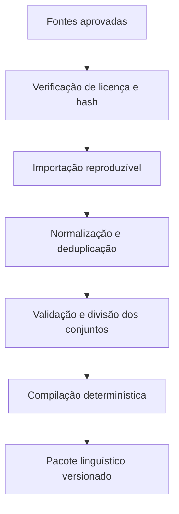
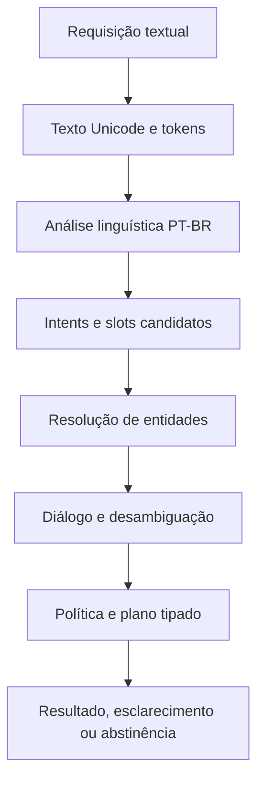
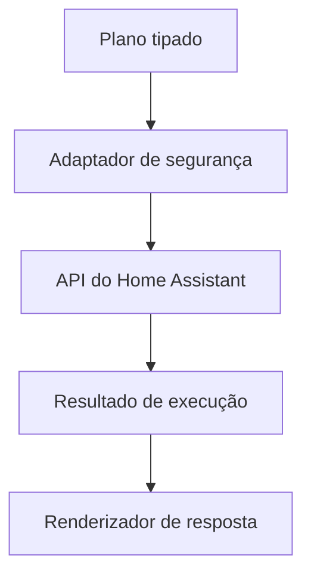

# Steering do projeto NLU determinístico PT-BR

Versão: 1.0  
Data: 2026-08-21  
Executor: GPT-5.6 Terra  
Orquestrador e revisor: GPT-5.6 Sol  
Estado inicial: arquitetura de trabalho definida; implementação ainda não autorizada sem handoff clean-room validado

## 1. Como usar este arquivo

Este documento é simultaneamente:

- arquitetura de referência do projeto;
- contrato permanente de engenharia;
- sequência de execução;
- conjunto de prompts faseados para o Terra;
- protocolo de handoff para o orquestrador;
- plano de validação e revisão adversarial.

Coloque este arquivo na raiz de um repositório novo, destinado exclusivamente à implementação independente. A sessão do Terra deve receber somente:

1. este arquivo;
2. o pacote sanitizado `docs/clean-room/` aprovado;
3. o conteúdo já produzido no próprio repositório de implementação.

Não forneça ao executor materiais de auditoria, código de produtos usados como referência, binários fechados, relatórios de engenharia reversa ou documentos excluídos pelo manifest clean-room.

Use apenas um prompt de fase por vez. O Terra não está autorizado a iniciar a fase seguinte por inferência.

### Fluxo obrigatório

1. Selecione `gpt-5.6-terra`.
2. Use esforço `high` nas fases linguísticas, de segurança e integração; `medium` é aceitável apenas nas fases mecânicas indicadas.
3. Cole o prompt da fase atual.
4. O Terra implementa, valida e cria o relatório da fase.
5. O estado passa para `READY_FOR_ORCHESTRATOR_REVIEW`.
6. O orquestrador revisa requisitos, diff, testes, decisões e riscos.
7. O orquestrador emite `APPROVED`, `CHANGES_REQUIRED`, `REJECTED` ou `BLOCKED`.
8. Somente `APPROVED` autoriza a fase seguinte.

O executor não deve usar subagentes, alterar o modelo ou elevar permissões por iniciativa própria. Isso só pode ocorrer se um prompt de fase autorizar expressamente.

## 2. Papéis

### Terra: executor

Responsabilidades:

- trabalhar apenas na fase autorizada;
- inspecionar o estado real do repositório antes de editar;
- implementar mudanças locais e reversíveis;
- registrar decisões e evidências;
- criar e executar testes relevantes;
- revisar o próprio diff;
- apresentar bloqueios sem preencher lacunas por plausibilidade;
- parar ao atingir as condições da fase.

O Terra não pode:

- redefinir arquitetura estrutural sem ADR;
- aprovar o próprio trabalho;
- selecionar palavras ou dados linguísticos usando conhecimento interno do modelo;
- inventar resultados de testes, métricas, licenças ou fontes;
- iniciar outra fase;
- fazer push, abrir PR, publicar pacote ou implantar sem autorização.

### Sol: orquestrador

Responsabilidades:

- decidir o escopo de cada execução;
- revisar contratos e decisões arquiteturais;
- conferir se a evidência sustenta as conclusões;
- avaliar testes e lacunas;
- emitir a decisão de gate;
- produzir prompts corretivos quando necessário;
- executar ou coordenar a revisão adversarial final.

### Usuário: autoridade do produto

Responsabilidades:

- aprovar decisões funcionais e jurídicas;
- fornecer objetivos e prioridades;
- decidir ações de risco, dependências controversas e publicação;
- controlar o conjunto oculto de avaliação;
- aceitar ou rejeitar riscos residuais.

## 3. Invariantes do projeto

Estas regras valem em todas as fases.

### 3.1 Implementação independente

- O núcleo linguístico e o runtime serão implementados de forma independente.
- Não copiar código, nomenclatura interna, tabelas, pesos, listas ou formatos privados de outro motor.
- Não consultar novamente produtos usados como referência durante a implementação.
- Algoritmos acadêmicos ou padrões públicos só podem ser usados com referência verificável e implementação própria ou dependência de licença compatível.
- Qualquer possível contaminação deve interromper a fase e ser registrada.

### 3.2 Dados e vocabulário

- O modelo não é fonte lexical.
- Nenhuma palavra entra no léxico sem proveniência registrada.
- Não gerar listas de palavras, sinônimos, contrações, frases, entidades ou flexões com IA para incorporá-las como dados reais.
- Fixtures sintéticas podem validar estruturas, Unicode e serialização, mas devem ser marcadas como `FIXTURE_TECNICA` e não podem alimentar treino, léxico ou avaliação de qualidade linguística.
- Todo dado importado precisa de origem, licença, versão, hash, transformação reproduzível e política de remoção.
- Treino, desenvolvimento e avaliação devem ser separados por origem e família, não apenas por linhas aleatórias.
- O conjunto oculto não pode ser fornecido ao executor nem usado para ajustar regras.

### 3.3 Determinismo

Com a mesma versão de:

- binário;
- configuração;
- pacote linguístico;
- catálogo de entidades;
- estado de sessão;
- requisição;

o sistema deve produzir a mesma saída serializada, exceto campos explicitamente não determinísticos, que devem ficar fora do resultado semântico.

Não usar aleatoriedade no runtime. Se uma ferramenta de treinamento exigir seed, ela deve ser explícita, registrada e testada quanto à reprodutibilidade.

### 3.4 Segurança

- O núcleo NLU não possui credenciais do Home Assistant.
- O núcleo não executa serviços e só produz planos tipados.
- O adaptador de execução é um processo ou limite de confiança separado.
- Toda ação deve ser validada novamente pelo adaptador.
- Ações sensíveis exigem política e, quando aplicável, confirmação.
- Determinismo não significa correção, autorização ou segurança.
- Entrada ambígua, contraditória ou fora do escopo deve provocar esclarecimento ou abstinência, nunca execução especulativa.

### 3.5 Qualidade de engenharia

- Proibido afirmar que um teste passou sem executar o comando.
- Falha de ambiente deve ser reportada separadamente de falha do produto.
- Todo comportamento novo exige teste direcionado.
- Todo bug corrigido exige teste de regressão.
- Dependências novas exigem justificativa, licença, manutenção e impacto de supply chain.
- Não incluir segredos, tokens, dumps reais de residência ou texto sensível em fixtures e logs.
- Não fazer mudanças destrutivas ou não relacionadas ao escopo.

## 4. Fontes de verdade e precedência

Em caso de conflito, use esta ordem:

1. decisão explícita mais recente do usuário;
2. ADR aceito no repositório de implementação;
3. requisitos sanitizados em `docs/clean-room/`;
4. este steering;
5. contratos públicos já aprovados;
6. testes que representam requisitos aprovados;
7. implementação existente.

Se duas fontes do mesmo nível divergirem, pare e abra uma decisão. Não escolha silenciosamente.

## 5. Objetivo do produto

Construir um motor NLU determinístico em português brasileiro, inicialmente especializado em automação residencial, capaz de transformar texto em zero, um ou vários planos de ação tipados.

O produto deve:

- operar localmente;
- funcionar sem LLM no runtime;
- preservar Unicode e offsets;
- interpretar múltiplos comandos;
- resolver entidades dinâmicas da residência;
- manter contexto curto e limitado;
- pedir esclarecimento quando necessário;
- abster-se quando não houver interpretação segura;
- gerar respostas textuais determinísticas;
- integrar-se ao Home Assistant por um adaptador separado;
- permitir auditoria da origem dos dados e das decisões.

Ficam fora do núcleo:

- reconhecimento de fala;
- síntese de voz;
- execução direta no Home Assistant;
- memória pessoal geral;
- resposta aberta de conhecimento geral;
- geração textual livre;
- treinamento online silencioso.

## 6. Arquitetura de alto nível

### 6.1 Plano offline de dados



### 6.2 Runtime



### 6.3 Execução externa



## 7. Componentes e responsabilidades

### 7.1 `nlu-core`

Núcleo independente de idioma:

- tipos canônicos;
- spans e diagnósticos;
- contratos dos estágios;
- orquestração do pipeline;
- resultado semântico;
- regras de determinismo;
- nenhuma rede e nenhuma credencial.

### 7.2 `lang-ptbr`

Implementação substituível do idioma:

- normalização não destrutiva;
- tokenização PT-BR;
- morfologia;
- análise gramatical;
- segmentação de orações;
- correferência linguística;
- regras comprovadas por dados e referências aprovadas.

### 7.3 `nlu-data`

Plano offline e acesso aos artefatos:

- manifests de origem;
- downloads controlados, quando autorizados;
- hashes e licenças;
- importadores;
- deduplicação;
- compilação estável;
- leitura do pacote em runtime;
- invalidação e remoção de fontes.

### 7.4 `intent-engine`

- schema declarativo de intents;
- slots tipados;
- restrições de domínio;
- casamento de evidências;
- ranking determinístico;
- margem de decisão;
- abstinência.

### 7.5 `entity-resolver`

- snapshots imutáveis do catálogo;
- aliases e IDs externos;
- áreas, andares, dispositivos e domínios;
- candidatos exatos e aproximados;
- compatibilidade de tipo;
- ambiguidade explícita;
- detecção de catálogo obsoleto.

### 7.6 `dialogue`

- sessões limitadas por TTL;
- intents pendentes;
- slots ausentes;
- candidatos de esclarecimento;
- referentes recentes;
- cancelamento;
- isolamento entre usuários e sessões.

### 7.7 `policy`

- classificação de risco;
- allowlist de operações;
- validação do plano;
- necessidade de confirmação;
- recusa de combinações inseguras;
- nenhuma execução.

### 7.8 `protocol`

- DTOs versionados;
- união discriminada de resultados;
- limites de tamanho;
- negociação de capacidades;
- códigos de erro estáveis;
- serialização determinística.

### 7.9 `server`

- transporte local;
- limites de concorrência e tempo;
- observabilidade;
- isolamento de sessões;
- carregamento atômico do pacote e catálogo;
- nenhuma conexão de saída.

### 7.10 `ha-adapter`

- único componente com credenciais do Home Assistant;
- importação do catálogo permitido;
- validação final do plano;
- chamada da API oficial;
- controle de timeout, retry e idempotência;
- retorno de resultados tipados;
- logs mínimos e sem segredos.

### 7.11 `response-renderer`

- templates versionados;
- concordância PT-BR baseada em features explícitas;
- respostas para sucesso, falha, parcial, esclarecimento e abstinência;
- nenhuma geração livre.

## 8. Modelo de domínio mínimo

Os nomes finais devem ser definidos por ADR, mas o comportamento abaixo é obrigatório.

| Conceito | Responsabilidade | Invariantes |
| --- | --- | --- |
| Entrada textual | Texto original e metadados | O original nunca é sobrescrito |
| Span | Intervalo no texto original | Limites válidos e em fronteiras UTF-8 |
| Unidade textual | Superfície, chave normalizada e span | Toda transformação mantém rastreabilidade |
| Análise morfológica | Lema e features possíveis | Pode conter múltiplas hipóteses |
| Oração | Grupo estrutural de unidades | Spans ordenados e não inventados |
| Candidato de intent | Schema, slots e evidências | Não é autorização de execução |
| Intent resolvido | Intent e slots semânticos | Todo slot obrigatório satisfeito ou marcado ausente |
| Referência de entidade | ID estável e versão do catálogo | Nunca executar somente pelo nome exibido |
| Plano de ação | Operação tipada e argumentos | Validável sem interpretar texto novamente |
| Contexto de sessão | Estado curto e limitado | Escopo, TTL e versão explícitos |
| Esclarecimento | Pergunta e opções permitidas | Não perde o intent pendente |
| Abstinência | Motivo estável | Não contém plano executável |
| Resultado de execução | Status por ação | Não altera retrospectivamente a interpretação |

## 9. Resultado canônico

Uma requisição pode resultar em exatamente uma variante:

- `understood`: um ou vários planos válidos;
- `clarification`: informação insuficiente ou candidatos equivalentes;
- `abstain`: fora de escopo, baixa evidência ou risco incompatível;
- `error`: falha de contrato, artefato ou infraestrutura.

O resultado deve separar:

- interpretação;
- evidência diagnóstica opcional;
- decisão de política;
- execução;
- resposta textual.

Scores não devem ser apresentados como probabilidade universal de correção sem calibração comprovada. A decisão deve usar limiar e margem definidos por avaliação, nunca por intuição do modelo.

## 10. Estrutura recomendada do repositório

```text
.
├── AGENTS.md
├── STEERING-NLU-PTBR.md
├── Cargo.toml
├── rust-toolchain.toml
├── crates/
│   ├── nlu-core/
│   ├── lang-ptbr/
│   ├── nlu-data/
│   ├── intent-engine/
│   ├── entity-resolver/
│   ├── dialogue/
│   ├── policy/
│   ├── protocol/
│   ├── server/
│   ├── ha-adapter/
│   └── response-renderer/
├── schemas/
├── data/
│   ├── manifests/
│   ├── sources.lock
│   ├── raw/
│   └── compiled/
├── evals/
│   ├── structural/
│   ├── public-dev/
│   └── README.md
├── docs/
│   ├── clean-room/
│   ├── adr/
│   ├── phases/
│   ├── evidence/
│   └── security/
├── tools/
└── xtask/
```

O conjunto oculto de avaliação deve permanecer fora do repositório acessível ao executor.

Não crie todos os crates antecipadamente se a fase não precisar deles. A estrutura é o destino, não autorização para scaffolding indiscriminado.

## 11. Contrato de status e gate

O arquivo `docs/phases/PROJECT-STATUS.md` deve conter:

```yaml
current_phase: P00
state: NOT_STARTED
orchestrator_decision: NONE
approved_baseline: null
open_blockers: []
last_validation: null
```

Estados permitidos:

- `NOT_STARTED`;
- `IN_PROGRESS`;
- `BLOCKED`;
- `READY_FOR_ORCHESTRATOR_REVIEW`;
- `APPROVED`.

Somente o orquestrador pode registrar `APPROVED`.

### Token de aprovação

Para começar uma fase após P00, o prompt deve incluir:

```text
ORCHESTRATOR_APPROVAL
previous_phase: PXX
decision: APPROVED
reviewed_baseline: <commit-ou-hash-do-diff>
conditions: <nenhuma-ou-lista>
```

Se o token estiver ausente ou incompatível com o status, o Terra deve parar sem editar.

### Relatório obrigatório de fase

Cada fase cria `docs/phases/PXX-REPORT.md` contendo:

- objetivo;
- baseline inicial;
- escopo executado;
- arquivos alterados;
- decisões e ADRs;
- dependências adicionadas e licenças;
- testes criados;
- comandos realmente executados;
- resultado dos comandos;
- métricas medidas;
- riscos e limitações;
- trabalho explicitamente não iniciado;
- diff stat;
- status final.

## 12. Validações comuns

Quando aplicáveis:

```text
cargo fmt --all -- --check
cargo clippy --workspace --all-targets --all-features -- -D warnings
cargo test --workspace --all-features
cargo build --workspace --all-targets
```

Também devem ser executados quando configurados:

- verificação de licenças e advisories;
- validação de JSON/YAML/schemas;
- testes de snapshot determinístico;
- testes de propriedade;
- fuzzing direcionado;
- benchmark reproduzível;
- build sem rede do runtime;
- verificação de SBOM.

Se um comando não estiver disponível, registre a causa e execute o melhor substituto verificável. Não instale ferramentas globalmente sem autorização.

## 13. Roadmap e gates

| Fase | Entrega | Esforço Terra | Gate principal |
| --- | --- | --- | --- |
| P00 | Bootstrap e validação clean-room | medium | Repositório e handoff íntegros |
| P01 | Fundação Rust e contratos | high | Tipos e limites compiláveis |
| P02 | Auditoria das fontes de dados | high | Nenhum dado sem licença/proveniência |
| P03 | Pipeline de dados vazio | high | Build reproduzível de fixture técnica |
| P04 | Unicode, normalização e spans | high | Original preservado e offsets corretos |
| P05 | Tokenização PT-BR estrutural | high | Regras comprovadas e reversíveis |
| P06 | Importação e léxico compilado | high | Somente fontes aprovadas |
| P07 | Morfologia PT-BR | high | Features avaliadas isoladamente |
| P08 | POS e desambiguação contextual | high | Baseline e avaliação reproduzíveis |
| P09 | Schemas, intents e slots | high | Abstinência e contratos seguros |
| P10 | Catálogo HA e entidades | high | IDs estáveis e ambiguidade explícita |
| P11 | Múltiplos intents | high | Coordenação e compartilhamento corretos |
| P12 | Sessão, correferência e esclarecimento | high | Isolamento e TTL corretos |
| P13 | Política, protocolo e servidor | high | NLU sem credenciais ou execução |
| P14 | Respostas e adaptador HA | high | Execução validada ponta a ponta |
| P15 | Evals, desempenho e empacotamento | high | Release candidate reproduzível |
| P16 | Pré-revisão adversarial do executor | high | Nenhum achado crítico ignorado |
| FINAL | Revisão adversarial independente | Sol | Aprovação de release |

---

# 14. Prompts faseados para o Terra

## Prompt P00 — Bootstrap e validação clean-room

```text
Você é o executor GPT-5.6 Terra deste projeto. Execute somente a fase P00 descrita em STEERING-NLU-PTBR.md.

Objetivo:
Validar que este é um repositório novo e independente, verificar o pacote docs/clean-room e estabelecer a governança do projeto. Não implemente código do motor.

Antes de editar:
1. Confirme a raiz do repositório e execute git status.
2. Leia integralmente STEERING-NLU-PTBR.md e todos os arquivos permitidos por docs/clean-room/HANDOFF-MANIFEST.json.
3. Valide os hashes do manifest.
4. Confirme que não existem materiais excluídos, fontes de referência proibidas ou código prévio não explicado.
5. Se o manifest estiver ausente, inválido, incompleto ou com hash divergente, crie somente docs/phases/P00-BLOCKERS.md e pare.

Implemente somente:
- AGENTS.md conciso referenciando este steering e suas invariantes;
- docs/phases/PROJECT-STATUS.md;
- docs/evidence/DEPENDENCY-REGISTER.md vazio e com schema documental;
- docs/adr/README.md com processo de decisão;
- política de logs, segredos, dependências, licenças e revisão;
- scripts locais mínimos para validar o manifest, se necessários.

Não faça:
- Cargo workspace;
- seleção ou download de fontes linguísticas;
- código Rust;
- exemplos linguísticos;
- pesquisa sobre motores de referência.

Condições de sucesso:
- hashes do handoff conferidos;
- árvore livre de material proibido conhecido;
- AGENTS.md e status válidos;
- nenhuma dependência ou dado linguístico incluído;
- relatório docs/phases/P00-REPORT.md completo;
- status READY_FOR_ORCHESTRATOR_REVIEW.

Revise o diff e pare. Não inicie P01.
```

## Prompt P01 — Fundação Rust e contratos

```text
[INCLUA O TOKEN ORCHESTRATOR_APPROVAL DE P00]

Leia STEERING-NLU-PTBR.md, AGENTS.md, docs/clean-room e o relatório P00. Execute somente P01.

Objetivo:
Criar a fundação Rust independente e os contratos de domínio, sem implementar lógica linguística.

Implemente:
- Cargo workspace mínimo;
- crates nlu-core e protocol;
- tipos canônicos para entrada, spans, hipóteses, slots, referências de entidade, planos, esclarecimento, abstinência e erros;
- traits ou interfaces para estágios substituíveis;
- serialização versionada dos contratos públicos;
- validação estrutural de invariantes;
- erros tipados, sem panic em entrada externa;
- ADRs para layout, offsets, versionamento e política de dependências.

Restrições:
- não criar normalizador, tokenizer, léxico ou matcher;
- não usar exemplos linguísticos como dados;
- não criar transporte de rede;
- dependências somente quando justificadas e registradas;
- evite excesso de crates e abstrações sem consumidor concreto.

Testes mínimos:
- round-trip de DTOs;
- spans válidos e inválidos;
- união discriminada de resultados;
- rejeição de versões incompatíveis;
- snapshots determinísticos usando apenas FIXTURE_TECNICA.

Condições de sucesso:
- workspace compila;
- fmt, clippy e testes passam;
- contratos cobrem todos os resultados canônicos;
- nlu-core não depende de rede, HA ou idioma;
- toda dependência está no registro;
- P01-REPORT.md completo;
- status READY_FOR_ORCHESTRATOR_REVIEW.

Pare antes de P02.
```

## Prompt P02 — Auditoria e seleção das fontes de dados

```text
[INCLUA O TOKEN ORCHESTRATOR_APPROVAL DE P01]

Execute somente P02. Esta é uma fase de pesquisa e decisão, não de importação.

Objetivo:
Identificar fontes candidatas para PT-BR, morfologia, POS, relações lexicais, frequência e erros de ASR, comprovando origem, licença e adequação antes de baixar dados.

Regras:
- use fontes oficiais, repositórios originais, artigos ou páginas formais de licença;
- abra as fontes; snippets de busca não são evidência;
- não assuma que gratuito significa redistribuível;
- diferencie uso acadêmico, comercial, atribuição, share-alike e restrição de derivados;
- não gere ou complete palavras com IA;
- não baixe datasets nesta fase;
- não selecione uma fonte quando a licença estiver ambígua.

Produza:
- docs/evidence/DATA-SOURCE-CANDIDATES.md;
- docs/evidence/DATA-LICENSE-MATRIX.md;
- docs/evidence/DATA-RISK-REGISTER.md;
- ADR de seleção provisória por função;
- schema final do manifest de fonte;
- plano de divisão treino/dev/avaliação por família e origem;
- lista de decisões humanas necessárias.

Cada candidato precisa de URL, mantenedor, versão/data, licença textual, uso pretendido, necessidade de redistribuição, riscos e evidência.

Condições de sucesso:
- nenhuma afirmação de licença sem fonte aberta;
- nenhuma palavra ou corpus importado;
- todas as funções de dados possuem candidato comprovado ou bloqueio explícito;
- fontes incompatíveis são rejeitadas, não relativizadas;
- P02-REPORT.md completo;
- status READY_FOR_ORCHESTRATOR_REVIEW.

Pare antes de P03.
```

## Prompt P03 — Pipeline de dados vazio e reproduzível

```text
[INCLUA O TOKEN ORCHESTRATOR_APPROVAL DE P02]

Execute somente P03.

Objetivo:
Implementar a infraestrutura de proveniência e compilação sem importar ainda o vocabulário real.

Implemente:
- crate nlu-data e xtask mínimo;
- schema versionado para source manifest e artifact manifest;
- verificação de licença declarada, hash, tamanho e versão;
- pipeline fetch/verify/import/normalize/validate/compile com fetch desabilitado por padrão;
- build offline a partir de fixtures técnicas locais;
- ordenação estável e bytes reproduzíveis;
- relatório de conteúdo e origem por artefato;
- mecanismo de remoção de todos os derivados de uma source_id;
- testes contra fonte não aprovada, hash incorreto, licença ausente e ordem instável.

Restrições:
- não baixar dados reais;
- não incluir palavras escolhidas pelo modelo;
- não definir formato binário como estável sem versão e checksum;
- não usar serialização insegura para entrada não confiável.

Condições de sucesso:
- duas compilações limpas produzem o mesmo SHA-256;
- build offline funciona;
- erro de proveniência falha fechado;
- todos os bytes gerados são rastreáveis a fixtures técnicas;
- fmt, clippy e testes passam;
- P03-REPORT.md completo;
- status READY_FOR_ORCHESTRATOR_REVIEW.

Pare antes de P04.
```

## Prompt P04 — Unicode, normalização e spans

```text
[INCLUA O TOKEN ORCHESTRATOR_APPROVAL DE P03]

Execute somente P04.

Objetivo:
Implementar a camada de texto Unicode preservando o original e a rastreabilidade de toda transformação.

Implemente:
- representação imutável do texto original;
- normalização Unicode escolhida por ADR e fundamentada em padrão público;
- chave secundária de comparação quando necessária, sem substituir a superfície;
- mapeamento entre texto transformado e spans do original;
- limites de tamanho, profundidade de transformação e combining marks;
- APIs que nunca cortam UTF-8 em fronteira inválida;
- testes de propriedade e regressão.

Não implemente:
- regras lexicais PT-BR;
- remoção global de acentos;
- tokenização semântica;
- correção ortográfica.

Ataques mínimos de teste:
- Unicode malformado na borda de protocolo;
- caracteres combinantes repetidos;
- zero-width e controles;
- formas canonicamente equivalentes;
- strings vazias e muito grandes;
- offsets no início e fim.

Condições de sucesso:
- original preservado byte a byte;
- spans sempre válidos;
- normalização idempotente;
- limites falham de forma tipada;
- nenhum dado linguístico criado;
- fmt, clippy e testes passam;
- P04-REPORT.md completo;
- status READY_FOR_ORCHESTRATOR_REVIEW.

Pare antes de P05.
```

## Prompt P05 — Tokenização PT-BR estrutural

```text
[INCLUA O TOKEN ORCHESTRATOR_APPROVAL DE P04]

Execute somente P05.

Objetivo:
Implementar tokenização estrutural extensível para PT-BR, ainda sem léxico real.

Antes de codificar:
- documente as regras necessárias a partir de padrões e referências aprovadas;
- se a regra depender de lista lexical inexistente, crie a interface e marque o comportamento como indisponível;
- não preencha a lista usando conhecimento do modelo.

Implemente:
- segmentação base;
- pontuação e separadores;
- números, decimais, horários e unidades apenas onde a especificação permitir;
- contrato para contrações, clíticos, abreviações e expressões multiunidade;
- preservação de spans e superfície;
- razão explícita para cada decisão de split/merge;
- fixtures estruturais e testes derivados apenas das fontes autorizadas ou exemplos humanos aprovados.

Não implemente:
- stemmer improvisado;
- tabela manual extensa;
- sinônimos;
- intents;
- correção ortográfica silenciosa.

Condições de sucesso:
- cada token aponta para o original;
- concatenação/trace permite explicar a segmentação;
- regras são idempotentes e determinísticas;
- casos não suportados permanecem explícitos;
- fmt, clippy e testes passam;
- P05-REPORT.md completo;
- status READY_FOR_ORCHESTRATOR_REVIEW.

Pare antes de P06.
```

## Prompt P06 — Importação aprovada e léxico compilado

```text
[INCLUA O TOKEN ORCHESTRATOR_APPROVAL DE P05 E A ALLOWLIST HUMANA DE FONTES]

Execute somente P06.

Objetivo:
Importar exclusivamente fontes aprovadas e produzir um léxico compilado, rastreável e consultável.

Pré-condição crítica:
Cada source_id deve constar na allowlist humana, ter licença confirmada, versão e hash esperado. Se faltar um item, pare sem baixar.

Implemente:
- download ou ingest controlado por source_id;
- cache fora do repositório quando apropriado;
- transformações puras e versionadas;
- deduplicação sem apagar conflitos;
- representação de lema, forma, features e origem;
- índices determinísticos;
- API de consulta read-only;
- relatório de cobertura por fonte sem afirmar qualidade sem eval;
- remoção seletiva de uma fonte e recompilação.

Proibido:
- completar lacunas lexicalmente com IA;
- aceitar palavra sem origem;
- misturar dados de avaliação no léxico;
- escolher arbitrariamente uma análise em caso de conflito.

Condições de sucesso:
- 100% das entradas têm source_id;
- artefato recompilado é byte-estável no mesmo ambiente declarado;
- remoção de fonte elimina todos os derivados verificavelmente;
- conflitos são observáveis;
- fmt, clippy e testes passam;
- P06-REPORT.md completo;
- status READY_FOR_ORCHESTRATOR_REVIEW.

Pare antes de P07.
```

## Prompt P07 — Morfologia PT-BR

```text
[INCLUA O TOKEN ORCHESTRATOR_APPROVAL DE P06]

Execute somente P07.

Objetivo:
Implementar análise morfológica PT-BR baseada apenas nos dados e referências aprovados.

Implemente:
- contrato de múltiplas análises por forma;
- lema e features explicitamente suportadas;
- concordância nominal e verbal apenas quando comprovada;
- tratamento de desconhecidos sem inventar lema;
- proveniência de análise lexical versus análise inferida;
- avaliação isolada em conjunto de desenvolvimento aprovado;
- matriz de confusão por feature.

Regras:
- heurística precisa de referência, justificativa e teste negativo;
- não expandir paradigmas sem fonte ou regra formal aprovada;
- não colapsar ambiguidade antes da camada contextual;
- não ajustar com conjunto oculto.

Condições de sucesso:
- análise é determinística e explicável;
- desconhecidos não recebem fatos inventados;
- métricas vêm de dataset versionado;
- erros conhecidos estão documentados;
- fmt, clippy e testes passam;
- P07-REPORT.md completo;
- status READY_FOR_ORCHESTRATOR_REVIEW.

Pare antes de P08.
```

## Prompt P08 — POS e desambiguação contextual

```text
[INCLUA O TOKEN ORCHESTRATOR_APPROVAL DE P07]

Execute somente P08.

Objetivo:
Criar um baseline POS reproduzível e uma cascata de desambiguação eficiente, sem misturar intent classification.

Antes de escolher algoritmo:
- registre baseline simples;
- compare pelo menos as opções compatíveis com determinismo, licença e runtime local;
- abra ADR com critérios de escolha;
- não escolha pela semelhança com qualquer produto externo.

Implemente somente a opção aprovada:
- fast path para análises inequívocas;
- modelo contextual para ambiguidades;
- tratamento de desconhecidos;
- treino offline determinístico;
- serialização versionada;
- eval separado por sentença/documento/origem;
- relatório de erros por tag e domínio.

Não faça:
- treino com dados sem manifest;
- split aleatório que vaze sentenças relacionadas;
- ajuste no conjunto oculto;
- afirmação de acurácia geral a partir de um domínio único.

Condições de sucesso:
- baseline e modelo comparáveis;
- treino reproduzível com seed/config registradas;
- runtime sem framework pesado não justificado;
- métricas e intervalos claramente delimitados;
- fmt, clippy e testes passam;
- P08-REPORT.md completo;
- status READY_FOR_ORCHESTRATOR_REVIEW.

Pare antes de P09.
```

## Prompt P09 — Schemas de intents e slots

```text
[INCLUA O TOKEN ORCHESTRATOR_APPROVAL DE P08]

Execute somente P09.

Objetivo:
Criar um motor declarativo e determinístico de intents e slots, ainda sem executar ações e sem catálogo real do Home Assistant.

Implemente:
- schema versionado;
- IDs estáveis de intent;
- slots tipados, obrigatórios e opcionais;
- restrições e validação;
- evidências rastreáveis aos spans;
- ranking estável;
- margem de decisão configurável;
- resultados understood, clarification e abstain;
- compilador/validador de schemas;
- conjunto pequeno de schemas estruturais aprovado pelo usuário.

Regras:
- frases não podem ser geradas em massa pelo modelo e tratadas como cobertura;
- score não é probabilidade sem calibração;
- ausência de slot obrigatório não pode produzir plano executável;
- empate material deve esclarecer ou abster;
- schema não pode conter chamada direta de serviço.

Condições de sucesso:
- schema inválido falha antes do runtime;
- saída é independente da ordem de mapas/arquivos;
- todos os slots têm tipo e origem;
- testes negativos superam apenas happy paths;
- fmt, clippy e testes passam;
- P09-REPORT.md completo;
- status READY_FOR_ORCHESTRATOR_REVIEW.

Pare antes de P10.
```

## Prompt P10 — Catálogo Home Assistant e resolução de entidades

```text
[INCLUA O TOKEN ORCHESTRATOR_APPROVAL DE P09]

Execute somente P10.

Objetivo:
Definir snapshots de catálogo e resolver alvos por ID, nome, alias, domínio, área e andar sem executar serviços.

Antes de integrar:
- verifique a documentação oficial atual do Home Assistant;
- documente quais APIs e campos são realmente disponíveis;
- não presuma estabilidade de campos internos;
- use fixtures sanitizadas, nunca dump real com dados pessoais.

Implemente:
- crate entity-resolver;
- snapshot imutável e versionado;
- IDs externos preservados;
- índices exatos e candidatos aproximados controlados;
- compatibilidade de domínio e tipo;
- resolução por área/andar;
- colisões e aliases maliciosos;
- catálogo stale/not-found;
- ranking explicável e decisão por margem;
- nenhuma credencial de HA no núcleo.

Condições de sucesso:
- nunca executar ou retornar alvo apenas por posição no catálogo;
- ambiguidades equivalentes resultam em clarification;
- troca de snapshot é atômica;
- nomes malformados não quebram protocolo/logs;
- fmt, clippy e testes passam;
- P10-REPORT.md completo;
- status READY_FOR_ORCHESTRATOR_REVIEW.

Pare antes de P11.
```

## Prompt P11 — Múltiplos intents e grafo de ações

```text
[INCLUA O TOKEN ORCHESTRATOR_APPROVAL DE P10]

Execute somente P11.

Objetivo:
Interpretar coordenação, sequência e compartilhamento de argumentos como um grafo explícito de ações.

Implemente:
- segmentação de orações baseada em evidência linguística;
- nós de ação e relações de ordem/coordenação;
- compartilhamento explícito de alvos e argumentos;
- distinção entre uma ação com vários alvos e várias ações;
- negação e escopo;
- comandos conflitantes;
- resultado parcial sem execução silenciosa do restante;
- serialização canônica do grafo.

Regras:
- não usar split ingênuo por conectivo;
- não propagar slot através de fronteira sem evidência;
- preservar ordem somente quando semanticamente declarada;
- conflitos sensíveis devem abster ou esclarecer.

Condições de sucesso:
- conjunto gold aprovado cobre coordenação, compartilhamento, ordem, negação e conflitos;
- correspondência exata do grafo é métrica principal;
- permutações irrelevantes serializam canonicamente;
- fmt, clippy e testes passam;
- P11-REPORT.md completo;
- status READY_FOR_ORCHESTRATOR_REVIEW.

Pare antes de P12.
```

## Prompt P12 — Sessão, correferência e esclarecimento

```text
[INCLUA O TOKEN ORCHESTRATOR_APPROVAL DE P11]

Execute somente P12.

Objetivo:
Adicionar contexto curto, correferência limitada e fluxo determinístico de esclarecimento.

Implemente:
- crate dialogue;
- session_id opaco;
- TTL explícito;
- limite de tamanho e turnos;
- intents pendentes e slots ausentes;
- opções de esclarecimento vinculadas a IDs estáveis;
- referentes recentes tipados;
- cancelamento e expiração;
- proteção contra replay, mistura de usuários e catálogo alterado;
- armazenamento em memória por padrão, com interface substituível.

Não implemente:
- memória pessoal ilimitada;
- aprendizado silencioso;
- recuperação sem vínculo de sessão;
- adivinhação de referente quando houver empate.

Condições de sucesso:
- isolamento concorrente entre sessões;
- sessão expirada não executa intent pendente;
- mudança de catálogo invalida candidatos incompatíveis;
- esclarecimento completa apenas o slot solicitado;
- fmt, clippy e testes passam;
- P12-REPORT.md completo;
- status READY_FOR_ORCHESTRATOR_REVIEW.

Pare antes de P13.
```

## Prompt P13 — Política, protocolo e servidor local

```text
[INCLUA O TOKEN ORCHESTRATOR_APPROVAL DE P12]

Execute somente P13.

Objetivo:
Expor o NLU localmente e aplicar política ao plano sem conceder capacidade de execução.

Implemente:
- crate policy;
- classificação de risco configurável;
- allowlists por operação e argumentos;
- requirement de confirmação;
- DTOs versionados finais;
- transporte local escolhido por ADR;
- limites de payload, timeout, concorrência e sessão;
- tratamento de JSON/frames malformados;
- tracing estruturado com redação de texto por padrão;
- health/readiness sem vazar dados;
- reload atômico de pacote e catálogo.

Restrições:
- server não recebe credenciais HA;
- server não abre conexão de saída;
- plano negado não é parcialmente executável;
- diagnóstico detalhado não deve vazar texto em produção por padrão.

Condições de sucesso:
- processo funciona sem rede externa;
- fuzz/suite negativa cobre parser e limites;
- política tem deny-by-default;
- protocolo rejeita versão desconhecida de forma tipada;
- fmt, clippy e testes passam;
- P13-REPORT.md completo;
- status READY_FOR_ORCHESTRATOR_REVIEW.

Pare antes de P14.
```

## Prompt P14 — Respostas e adaptador Home Assistant

```text
[INCLUA O TOKEN ORCHESTRATOR_APPROVAL DE P13]

Execute somente P14.

Objetivo:
Implementar o único limite com credenciais, executar planos validados e renderizar respostas determinísticas.

Antes de codificar:
- confirme APIs oficiais e comportamento atual do Home Assistant;
- abra ADR para transporte, autenticação, retry, idempotência e confirmação;
- use uma instância de teste ou mock autorizado, nunca produção por padrão.

Implemente:
- crate ha-adapter;
- armazenamento seguro de credenciais fora do repositório;
- revalidação de operação, entidade, domínio e argumentos;
- proteção contra catálogo obsoleto;
- timeout e retry somente quando idempotente;
- resultado por ação em multi-intent;
- tratamento de sucesso parcial;
- crate response-renderer;
- templates versionados e validados;
- concordância baseada em features explícitas;
- e2e com mock e ambiente de teste autorizado.

Condições de sucesso:
- core e server continuam sem credenciais;
- adaptador rejeita plano adulterado;
- ação sensível não passa sem confirmação válida;
- retry não duplica ação não idempotente;
- resposta distingue interpretação de execução;
- fmt, clippy, testes e e2e passam;
- P14-REPORT.md completo;
- status READY_FOR_ORCHESTRATOR_REVIEW.

Pare antes de P15.
```

## Prompt P15 — Avaliação, desempenho e empacotamento

```text
[INCLUA O TOKEN ORCHESTRATOR_APPROVAL DE P14]

Execute somente P15.

Objetivo:
Medir o sistema completo, otimizar apenas gargalos comprovados e produzir um release candidate reproduzível.

Implemente:
- runner de evals versionado;
- métricas: exact intent, slot, grafo multi-intent, resolução de entidade, esclarecimento, abstinência e falso plano seguro;
- conjuntos separados para texto limpo, ruído de ASR e casos negativos;
- benchmark p50/p95/p99, throughput, RSS, startup e tamanho do pacote;
- comparação antes/depois de cada otimização;
- profiles release reproduzíveis;
- containers/add-on somente se previstos pelos requisitos;
- SBOM, inventário de licença e checksums;
- guia de operação, backup, atualização e rollback.

Regras:
- conjunto oculto é executado por processo separado e só retorna métricas agregadas;
- não ajustar regra depois de ver casos ocultos individuais;
- não otimizar sem profile;
- não divulgar número como geral fora do domínio avaliado;
- não ignorar falsos positivos em favor de cobertura.

Condições de sucesso:
- clean build reproduzível;
- todas as métricas têm dataset e versão;
- nenhum P0/P1 conhecido aberto;
- dependências e fontes têm licença registrada;
- artefatos têm checksum;
- rollback testado;
- P15-REPORT.md completo;
- status READY_FOR_ORCHESTRATOR_REVIEW.

Pare antes de P16.
```

## Prompt P16 — Pré-revisão adversarial do Terra

```text
[INCLUA O TOKEN ORCHESTRATOR_APPROVAL DE P15]

Execute somente P16. Não corrija primeiro; tente quebrar o sistema e registre a baseline.

Objetivo:
Realizar uma pré-revisão adversarial ampla antes de entregar o release candidate ao Sol.

Ataque pelo menos:
- Unicode confusável, zero-width, combining marks e payloads extremos;
- parser/protocolo malformado, profundidade e frames parciais;
- nomes e aliases contendo JSON, templates, controles e texto enganoso;
- colisões de entidade e catálogo stale;
- negação, escopo, coordenação, contradição e comandos parciais;
- sessões cruzadas, expiradas, repetidas e concorrentes;
- adulteração de plano entre NLU e adaptador;
- ações sensíveis sem confirmação;
- retry e duplicação;
- falha parcial de múltiplas ações;
- data leakage, contaminação de eval e fonte sem licença;
- não determinismo por mapas, concorrência, locale, timezone e ordem de arquivos;
- exaustão de CPU, memória e sessão;
- supply chain, unsafe, secrets e logs sensíveis;
- instalação, atualização e rollback.

Procedimento:
1. Registre baseline e comandos.
2. Crie testes ou reproduções mínimas para cada achado real.
3. Classifique P0, P1, P2 ou P3.
4. Corrija somente achados dentro do escopo e repita os testes.
5. Não reclassifique severidade para conseguir aprovação.
6. Liste riscos aceitos que exigem decisão humana.

Condições de sucesso:
- matriz adversarial completa;
- todo achado tem evidência reproduzível;
- nenhum P0/P1 conhecido permanece aberto;
- correções têm regressão;
- suite comum e adversarial passa;
- P16-REPORT.md completo;
- status READY_FOR_ORCHESTRATOR_REVIEW.

Pare. Não declare release aprovado.
```

---

# 15. Prompt de revisão de cada fase para o Sol

Use este prompt comigo após cada entrega do Terra:

```text
Atue como orquestrador e gatekeeper do projeto NLU PT-BR. Revise a fase <PXX> contra STEERING-NLU-PTBR.md, docs/clean-room, ADRs aceitos, diff atual e <PXX-REPORT.md>.

Não implemente correções nesta revisão.

Verifique:
- aderência estrita ao escopo;
- condições de sucesso;
- afirmações versus evidências;
- testes realmente executados;
- regressões e lacunas;
- determinismo;
- dados e licenças;
- segurança;
- mudanças fora da fase;
- trabalho iniciado prematuramente.

Classifique achados por P0/P1/P2/P3 e cite arquivos/símbolos. Emita exatamente uma decisão:
- APPROVED;
- CHANGES_REQUIRED;
- REJECTED;
- BLOCKED.

Se APPROVED, produza o token ORCHESTRATOR_APPROVAL para a próxima fase com o baseline revisado.
Se CHANGES_REQUIRED, produza um prompt corretivo limitado à fase atual e não autorize a próxima.
```

## Formato da decisão

```yaml
ORCHESTRATOR_DECISION:
  phase: PXX
  decision: APPROVED | CHANGES_REQUIRED | REJECTED | BLOCKED
  reviewed_baseline: <sha-ou-identificador-do-diff>
  critical_findings: []
  required_changes: []
  accepted_risks: []
  next_phase_authorized: PYY | null
```

---

# 16. Revisão adversarial final independente

Esta revisão deve ser feita pelo Sol em uma sessão de revisão, preferencialmente read-only, usando o release candidate congelado. O Terra não participa da decisão.

## Prompt final para o Sol

```text
Você é o revisor adversarial independente e autoridade final de gate deste release candidate de um NLU determinístico PT-BR para Home Assistant.

Trabalhe em modo read-only. Não confie nos relatórios do executor como prova suficiente: reproduza verificações críticas no código e nos artefatos. Não implemente correções nesta passagem.

Fontes de verdade:
1. requisitos sanitizados;
2. ADRs aceitos;
3. STEERING-NLU-PTBR.md;
4. release candidate congelado;
5. resultados reproduzidos por você.

Objetivo:
Tentar refutar a prontidão do release. Procure falhas que possam gerar execução incorreta, confusão de entidade, vazamento de dados, não determinismo, contaminação de avaliação, violação de licença ou impossibilidade de reproduzir o build.

Trilhas obrigatórias:

1. Rastreabilidade
- Mapeie cada requisito para código e teste.
- Identifique requisito sem implementação, código sem requisito e teste circular.

2. Independência e licenças
- Procure nomes, trechos, estruturas ou dados sem origem.
- Verifique dependências, fontes, manifests, atribuições e possibilidade de remoção.
- Trate licença ambígua como bloqueio de distribuição.

3. Determinismo
- Repita builds e execuções em ordens e níveis de concorrência diferentes.
- Verifique maps, timestamps, locale, timezone, seeds, path absoluto e ordem de filesystem.
- Compare bytes e resultados semânticos.

4. Segurança do plano e executor
- Tente adulterar intents, entidade, domínio, parâmetros, risco e confirmação.
- Tente replay, catálogo stale, sessão trocada e chamada não autorizada.
- Confirme deny-by-default e ausência de credenciais no core/server.

5. Linguística adversarial PT-BR
- Negação e escopo.
- Coordenação e compartilhamento de argumentos.
- Ambiguidade morfológica e de entidade.
- Referentes ausentes, concorrentes ou expirados.
- Comandos contraditórios, incompletos e fora do domínio.
- Texto ruidoso de ASR separado de erro ortográfico real.
- Não crie novos casos para treino; use-os somente como avaliação adversarial rotulada.

6. Unicode e protocolo
- Confusables, controles, zero-width, combining marks, limites, framing, JSON e versões.
- Alias e template injection.
- Logs e erros não devem refletir segredos ou conteúdo cru por padrão.

7. Concorrência e recursos
- Corridas de sessão, reload de catálogo/pacote e cancelamento.
- Limites de CPU, memória, payload, conexões e sessões.
- Falhas devem degradar para erro/abstinência, nunca plano parcial inseguro.

8. Avaliação
- Procure vazamento por frase, template, residência, entidade, fonte e transformação.
- Verifique se o conjunto oculto permaneceu oculto.
- Recalcule métricas e denominadores.
- Diferencie cobertura, precisão, esclarecimento e falso positivo.

9. Operação
- Clean install, upgrade, incompatibilidade de pacote, rollback e recuperação.
- Checksums, SBOM, configuração mínima e mensagens de erro.

10. Supply chain
- Advisories, dependências abandonadas, build scripts, unsafe e downloads não fixados.

Se possível, execute fmt, clippy, testes, build release, verificações de licença, fuzzers direcionados e evals. Registre comandos e limitações.

Severidade:
- P0: execução perigosa, credencial exposta, contaminação/legalidade bloqueante ou corrupção grave;
- P1: correção central, segurança, determinismo ou requisito obrigatório quebrado;
- P2: falha relevante com mitigação ou cobertura insuficiente;
- P3: manutenção, clareza ou melhoria não bloqueante.

Critério de aprovação:
- nenhum P0 ou P1 aberto;
- todo P2 possui correção ou aceitação explícita com responsável;
- build e testes críticos reproduzidos;
- dados e dependências rastreáveis;
- eval sem vazamento conhecido;
- rollback verificável;
- riscos residuais apresentados ao usuário.

Saída obrigatória:
1. decisão RELEASE_APPROVED ou RELEASE_REJECTED;
2. resumo executivo;
3. achados ordenados por severidade com evidência;
4. comandos executados e resultados;
5. requisitos sem prova;
6. riscos residuais;
7. prompt corretivo para o Terra, se rejeitado;
8. checklist de revalidação após correção.

Não aprove por ausência de achados. Aprove somente com evidência positiva suficiente.
```

---

# 17. Prompt corretivo genérico para o Terra

Use somente quando o orquestrador retornar `CHANGES_REQUIRED` ou `RELEASE_REJECTED`.

```text
Você é o executor Terra. Corrija somente os achados listados abaixo no baseline <BASELINE>. Não avance de fase e não faça refatorações oportunistas.

Achados autorizados:
<COLE A LISTA EXATA DO ORQUESTRADOR>

Para cada achado:
1. Reproduza antes de alterar.
2. Adicione teste de regressão que falhe na baseline.
3. Faça a menor correção arquiteturalmente correta.
4. Execute a validação direcionada.
5. Execute a suite comum afetada.
6. Registre antes/depois e riscos residuais.

Se não conseguir reproduzir, não improvise uma correção; registre evidência e pare nesse item.

Atualize o relatório da fase com uma seção REMEDIATION e retorne a READY_FOR_ORCHESTRATOR_REVIEW. Não marque APPROVED.
```

# 18. Definição global de pronto

O projeto só pode ser considerado pronto quando:

- requisitos funcionais e não funcionais estiverem rastreados;
- runtime for local e determinístico;
- núcleo permanecer sem credenciais e sem execução;
- ambiguidades perigosas resultarem em esclarecimento ou abstinência;
- fontes e dependências estiverem licenciadas e rastreáveis;
- nenhum dado tiver sido criado por alucinação do modelo;
- build, artefatos e métricas forem reproduzíveis;
- conjunto oculto não tiver contaminado desenvolvimento;
- testes comuns, negativos, adversariais e de regressão passarem;
- nenhum P0/P1 permanecer aberto;
- rollback e recuperação estiverem testados;
- o Sol emitir `RELEASE_APPROVED`;
- o usuário aceitar explicitamente os riscos residuais e autorizar publicação.

Até essa aprovação, qualquer build deve ser tratado como experimental.

# 19. Referências de orquestração

Estas referências orientam apenas o uso do Codex e não são fontes linguísticas do produto:

- [Boas práticas do Codex](https://learn.chatgpt.com/guides/best-practices)
- [Configuração e escolha de modelos para agentes](https://learn.chatgpt.com/docs/agent-configuration/subagents)
- [Boas práticas de avaliação](https://developers.openai.com/api/docs/guides/evaluation-best-practices)

A escolha do Terra como executor é uma decisão operacional do usuário. As fases pequenas, os gates do Sol e a revisão adversarial compensam o fato de a documentação oficial posicionar o Terra principalmente como opção de maior eficiência para tarefas mais delimitadas.
