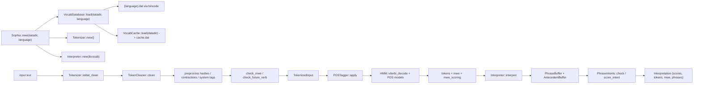

# Sistema Atual Inspecionado

Data da inspeção: 2026-08-12

## Escopo real da auditoria

- `CONFIRMADO`: o workspace fornecido ao agente estava vazio e sem Git `[E-001] [E-002]`.
- `CONFIRMADO`: por isso, o “sistema atual” descrito abaixo é o artefato público oficial efetivamente inspecionado nesta fase: `cicero-sophia 0.6.5`, com apoio de `sophia-interfaces 0.6.0` e documentação pública do site do autor `[E-003] [E-033] [E-035]`.
- `DESCONHECIDO`: o estado do repositório Git original referido pelo pacote em `https://github.com/cicero-ai/cicero`, porque a API pública do GitHub retornou `404` para consultas não autenticadas em 2026-08-12 `[E-009]`.

## Resumo executivo

`CONFIRMADO`: o núcleo público inspecionado é um crate Rust que:

- carrega um artefato lexical binário `{language}.dat` via `bincode`;
- tokeniza texto com limpeza inicial, normalização limitada e reconhecimento de MWEs;
- aplica POS tagging com HMM + Viterbi e modelos de contexto;
- interpreta o fluxo tokenizado em frases com estruturas de substantivos, verbos, adjetivos, advérbios e coreferência básica;
- agrega um único intent por frase, além de scores de classificação agregados.

`CONFIRMADO`: o pacote público não inclui adaptador Home Assistant, protocolo de sessão, nem pipeline público de treinamento/compilação do léxico `[E-030] [E-035] [E-037]`.

## Estado local do workspace

| Item | Status | Evidência |
| --- | --- | --- |
| Workspace local do projeto | vazio | `[E-001]` |
| Repositório Git local | ausente | `[E-001]` |
| Código Rust local do motor | ausente | `[E-002]` |
| Docs pré-existentes no workspace | ausentes | `[E-002]` |

Consequência:

- `CONFIRMADO`: esta fase não pôde auditar uma árvore local de código do motor.
- `DECISÃO PROPOSTA`: toda documentação desta fase distingue explicitamente “artefato público inspecionado” de “produto alvo deste projeto”.

## Artefatos públicos inspecionados

| Artefato | Tipo | Evidência principal | Status |
| --- | --- | --- | --- |
| `cicero-sophia 0.6.5` | crate Rust público | `[E-003] [E-004] [E-005]` | inspecionado |
| `sophia-interfaces 0.6.0` | crate Rust público | `[E-033] [E-034]` | inspecionado |
| `cicero.sh/sophia` | documentação/marketing | `[E-035] [E-036]` | inspecionado |
| `cicero.sh/sophia/integration` | documentação de integração | `[E-035]` | inspecionado |
| repositório GitHub referenciado | origem declarada, mas não acessível publicamente nesta fase | `[E-009]` | não confirmado |

## Mapa de módulos confirmados

| Módulo | Símbolos principais | Papel confirmado | Evidência |
| --- | --- | --- | --- |
| `lib.rs` | `pub mod error`, `interpret`, `pos_tagger`, `sophia`, `tokenizer`, `vocab` | superfície modular pública | `[E-010]` |
| `sophia.rs` | `Sophia`, `new`, `tokenize`, `interpret`, `get_token`, `get_word`, `get_category` | fachada do runtime | `[E-011] [E-012]` |
| `vocab/database.rs` | `VocabDatabase`, `VocabDatabaseMeta`, `VocabPreProcessDatabase`, `VocabWordDatabase`, `load`, `save` | schema e carga do banco lexical compilado | `[E-013] [E-014]` |
| `vocab/cache.rs` | `VocabCache`, `load`, `save` | cache persistente de typos | `[E-015]` |
| `tokenizer/tokenizer.rs` | `Tokenizer`, `Buffer`, `initial_clean`, `preprocess`, `check_mwe`, `check_future_verb` | tokenização, tags especiais e MWEs | `[E-017] [E-019]` |
| `tokenizer/cleaner.rs` | `TokenCleaner`, `scan_chars`, `classify_numeric`, `is_time`, `is_decade` | limpeza de token e regras de número/tempo | `[E-018]` |
| `tokenizer/input.rs` | `TokenizedInput`, `MWE` | representação do resultado de tokenização | `[E-031]` |
| `tokenizer/token.rs` | `Token`, `TokenType`, helpers `is_*` | estrutura rica de token | `[E-024]` |
| `pos_tagger/hmm.rs` | `HMM`, `apply`, `viterbi_decode`, `calculate_viterbi` | POS tagging via HMM/Viterbi | `[E-021]` |
| `pos_tagger/model.rs` | `POSModel`, `POSTagModel`, `POSTagModelRepo`, `predict` | modelos contextuais e heurísticas de prefixo/sufixo | `[E-023]` |
| `pos_tagger/context.rs` | `POSContext`, `POSFeature`, listas léxicas | contexto POS e features linguísticas | `[E-022]` |
| `pos_tagger/pos_tag.rs` | `POSTag` | tagset Penn Treebank modificado | `[E-020]` |
| `interpret/interpreter.rs` | `Interpreter`, `interpret` | transformação de fluxo tokenizado em interpretação | `[E-025]` |
| `interpret/phrase_buffer.rs` | `PhraseBuffer`, `add_noun`, `add_verb`, `add_pronoun`, `add_intent`, `score_intent` | construção incremental de frases | `[E-027] [E-028]` |
| `interpret/phrase.rs` | `Phrase`, `Noun`, `Verb`, `Adjective`, `Adverb` | IR sintático-semântica interna atual | `[E-026]` |
| `interpret/antecedent_buffer.rs` | `AntecedentBuffer` | resolução de antecedentes | `[E-029]` |
| `vocab/phrase_intents.rs` | `PhraseIntents`, `PhraseIntent` | trie de intents frasais | `[E-027]` |
| `sophia-interfaces/src/lib.rs` | `SophiaInterface`, `SophiaProInterface`, `SelectorResponse`, `SophiaSharedLibrary` | interface pública da edição premium / shared library | `[E-034]` |

## Fluxo de execução confirmado

### Inicialização

1. `Sophia::new(datadir, language)` chama `VocabDatabase::load(datadir, language)` `[E-012]`.
2. `VocabDatabase::load` abre `{datadir}/{language}.dat` e desserializa em `VocabDatabase` via `bincode` `[E-013]`.
3. O cache `cache.dat` é carregado separadamente em `VocabCache` `[E-015]`.
4. O runtime instancia `Interpreter::new(&vocab)` e `Tokenizer::new()` `[E-012]`.

### Tokenização

1. `Tokenizer::initial_clean` prepara o texto, insere `|NL|` e remove não ASCII `[E-017]`.
2. `TokenCleaner` separa prefixos/sufixos e detecta números, horários, décadas e posse por `"'s"` `[E-018]`.
3. O tokenizador consulta `vocab.preprocess.hashes` para contrações, tags especiais e pré-processamento `[E-019]`.
4. `check_mwe` e `check_future_verb` percorrem tries armazenadas no vocabulário para MWEs e verbos futuros `[E-019]`.
5. O `POSTagger` é aplicado ao `TokenizedInput` resultante `[E-021]`.

### POS tagging

1. O tagger executa correção ortográfica contextual para tokens `FW` antes da resolução POS `[E-023]`.
2. O HMM aplica Viterbi por sentença até `POSTag::SS` `[E-021]`.
3. Palavras ambíguas podem ser refinadas por modelos de palavra, modelos de tag e features de contexto `[E-021] [E-022] [E-023]`.

### Interpretação

1. `Interpreter::interpret` chama `tokenizer.encode(...)` novamente e cria `PhraseBuffer` `[E-025]`.
2. O fluxo percorre `tokens.mwe()`, não apenas `tokens.iter()` `[E-025]`.
3. `PhraseBuffer` agrega substantivos, verbos, preposições, determinantes, advérbios, adjetivos e pronomes `[E-026]`.
4. A resolução de pronome consulta `AntecedentBuffer` `[E-029]`.
5. `PhraseIntents` marca intents locais, mas `score_intent` reduz o resultado a um único intent por frase `[E-027]`.
6. O retorno final é `Interpretation { scores, tokens, mwe, phrases }` `[E-025]`.

## Estruturas principais confirmadas

### `VocabDatabase`

`CONFIRMADO`: o artefato lexical compilado combina:

- `meta`: versão, idioma, autor, hash, assinatura e comentário `[E-014]`;
- `preprocess`: hashes, spellchecker, `future_verb_prefixes`, `stop_words`, `predicative_verbs`, `auxillary_verbs`, `infinitive_prefixes` `[E-014]`;
- `words`: `wordlist`, `pos_tagger`, `mwe`, `capitalization`, `future_verbs`, `phrase_intents`, `id2token`, `plural` `[E-014]`;
- `categories`: árvore/ranges de categorias lexicais `[E-014]`;
- `cache`: mutex para `VocabCache` em runtime `[E-014] [E-015]`.

### `Token`

`CONFIRMADO`: o token atual já carrega muita informação lexical:

- forma;
- índice;
- stem e stems potenciais;
- POS atual e POS potenciais;
- categorias e NER;
- relações léxicas (`synonyms`, `hypernyms`, `hyponyms`);
- scores de classificação;
- pronome e antecedente;
- campos internos (`inner_word`, `inner_value`, `inner_unit`) para tags especiais `[E-024]`.

### `Phrase`

`CONFIRMADO`: a interpretação final atual trabalha por frase e não por um grafo multi-intent global:

- `range`, `split_token`;
- vetores de `nouns` e `verbs`;
- `tense`, `person`, `classification`;
- um único `intent: (PhraseIntent, f32)` `[E-026] [E-027]`.

## Formatos de dados confirmados

| Formato | Papel | Confirmação |
| --- | --- | --- |
| `{language}.dat` | banco lexical compilado | `[E-013]` |
| `cache.dat` | cache persistente de typos | `[E-015]` |
| `TokenizedInput` | resultado iterável de tokenização | `[E-031]` |
| `Interpretation` | resultado de interpretação do crate público | `[E-025]` |
| `TokenizedOutput` / `InterpretedOutput` em `sophia-interfaces` | DTOs serializáveis da interface premium | `[E-034]` |

## Algoritmos confirmados

| Área | Algoritmo / técnica confirmada | Evidência |
| --- | --- | --- |
| limpeza inicial | regex + remoção de não ASCII | `[E-017]` |
| tokenização | scanner por caractere com prefixos/sufixos | `[E-018]` |
| MWEs | trie de MWEs e trie de future verbs | `[E-019]` |
| POS tagging | HMM com Viterbi | `[E-021]` |
| contexto POS | features de contexto e listas léxicas | `[E-022]` |
| correção ortográfica | coortes + distância de Levenshtein + contexto | `[E-023]` |
| intents frasais | trie + score por comprimento | `[E-027]` |
| correferência | antecedentes por gênero/número/pessoa | `[E-029]` |

## Partes ausentes, fechadas ou não confirmadas

### Não encontradas no crate público inspecionado

- pipeline público de treinamento;
- compilador público do arquivo `{language}.dat`;
- benchmarks;
- testes automatizados no pacote publicado;
- sessão de diálogo persistente;
- perguntas de esclarecimento;
- integração Home Assistant;
- protocolo local open-source do binário premium;
- resolução multi-intent por sentença como recurso explícito de runtime `[E-027] [E-030] [E-035] [E-037]`.

### Fechadas ou indisponíveis nesta fase

- checkout público do repositório GitHub referenciado `[E-009]`;
- código-fonte do binário premium/CLI/RPC citado no site `[E-035]`;
- qualquer ferramenta privada de importação/seleção da edição premium além da interface pública em `sophia-interfaces` `[E-034]`.

### Limitações de validação desta auditoria

- `CONFIRMADO`: `cargo` não está disponível no ambiente de execução desta fase `[E-038]`.
- `CONFIRMADO`: houve inconsistência estática entre exemplos e API pública, mas ela não pôde ser validada por compilação `[E-032] [E-038]`.

## Divergências internas relevantes

| Divergência | Evidência | Impacto |
| --- | --- | --- |
| manifesto/licença vs README | `[E-004] [E-006] [E-008] [E-036]` | risco jurídico e documental |
| exemplos vs assinaturas públicas | `[E-012] [E-032]` | baixa confiança na documentação de uso |
| `remove_stop_words()` vs iterador | `[E-031]` | API pública potencialmente incompleta |
| `build.rs` linka `bz2`/`zstd` sem uso Rust confirmado | `[E-016]` | dependência/propósito ainda não confirmado |

## Diagrama Mermaid do fluxo atual inspecionado

## Conclusão do sistema atual inspecionado

- `CONFIRMADO`: existe um núcleo NLU determinístico público em Rust com artefato lexical binário, tokenização, POS tagging, correferência e parsing frasal `[E-012] [E-013] [E-021] [E-025] [E-029]`.
- `CONFIRMADO`: o núcleo público inspecionado está fortemente acoplado ao inglês em Unicode, léxico, morfologia, tagset e heurísticas de pessoa/tempo `[E-017] [E-018] [E-019] [E-020] [E-022] [E-023] [E-028]`.
- `DESCONHECIDO`: o conjunto completo do sistema Sophia/Cicero fora desses artefatos públicos, inclusive o binário premium, sua integração real e o repositório principal referenciado `[E-009] [E-035]`.
