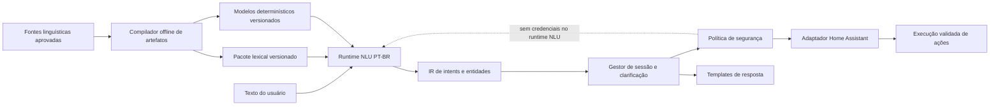
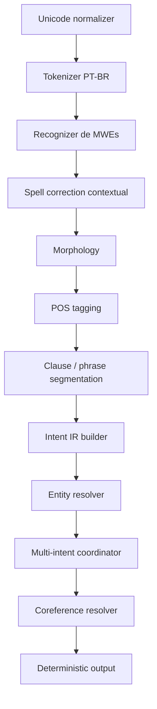

# Arquitetura-Alvo PT-BR

Data da proposta: 2026-08-12

Status:

- todo item marcado como `PROPOSTA` ou `DECISÃO PROPOSTA` pertence a este projeto;
- nada neste arquivo descreve comportamento confirmado do Sophia além do que já está documentado no sistema atual.

## Princípios de projeto

### DECISÃO PROPOSTA

- runtime determinístico e offline;
- separação rígida entre compilação offline de dados e runtime;
- núcleo NLU sem credenciais e sem dependência de Home Assistant;
- adaptador Home Assistant separado, validando domínio, entidade, serviço e parâmetros;
- PT-BR tratado como idioma com regras próprias, não como “inglês com vocabulário trocado”;
- artefatos linguísticos versionados, reproduzíveis e auditáveis;
- fallbacks explícitos e observáveis, sem comportamento oculto.

## Limites do sistema

### CONFIRMADO sobre o estado atual

- o núcleo público atual mistura tokenização, POS, parsing e interpretação numa mesma biblioteca `[E-012] [E-025]`.

### DECISÃO PROPOSTA para o produto alvo

- separar em cinco planos:
  - compilação offline de dados;
  - runtime NLU;
  - sessão de diálogo;
  - execução de ações;
  - geração de respostas.

## Diagrama de contexto



## Diagrama interno do runtime



## Componentes e contratos

| Componente | Responsabilidade | Entrada | Saída | Dependências permitidas | Estado persistente | Falhas esperadas | Fallback | Teste principal | Camada |
| --- | --- | --- | --- | --- | --- | --- | --- | --- | --- |
| normalizador Unicode | canonizar entrada sem destruir diacríticos | texto cru | texto normalizado + mapa de offsets | `std`, tabelas Unicode aprovadas, sem rede | nenhum | sequência inválida, normalização ambígua | preservar forma original e marcar aviso | testes de round-trip, diacríticos e offsets | núcleo genérico |
| tokenizador configurável por idioma | segmentar texto em tokens e spans | texto normalizado | sequência de tokens com spans | `std`, regex/automata determinísticos, config de idioma | nenhum | pontuação atípica, STT ruidoso, grafia coloquial | segmentação conservadora por delimitadores | suite de segmentação por casos reais | núcleo genérico |
| reconhecedor de MWEs | colapsar expressões multi-palavra aprovadas | tokens + léxico compilado | tokens enriquecidos / spans compostos | tries/FSTs aprovados, sem rede | nenhum | conflito entre MWEs concorrentes | política determinística de precedência | testes de conflito e longest-match | núcleo genérico |
| banco lexical compilado | fornecer lookup lexical reproduzível | chave lexical, token, categoria | entrada lexical tipada | loader binário, serialização aprovada | artefatos versionados somente leitura | artefato ausente ou incompatível | fail-fast na inicialização | checksums, compatibilidade de versão | núcleo genérico |
| correção ortográfica contextual | sugerir correção controlada e auditável | tokens + contexto + config | token original + sugestão + motivo | distância lexical, cohorts, regras aprovadas | cache opcional de observações auditáveis | múltiplas correções plausíveis, baixa confiança | manter original e anexar candidatos | testes com STT/typos rotulados | núcleo genérico |
| morfologia PT-BR | gerar análises de lema, flexão, gênero, número, pessoa, tempo, modo | tokens + léxico | análises morfológicas candidatas | artefatos morfológicos aprovados | artefatos somente leitura | ambiguidade morfológica | emitir múltiplas leituras com score determinístico | testes de cobertura morfológica | núcleo genérico |
| POS tagging | escolher POS final por contexto | tokens + análises morfológicas | tokens com POS final e justificativa | HMM/modelos determinísticos, features aprovadas | artefatos de modelo somente leitura | empate, desconhecido, OOV | tag `unknown`/classe aberta + trilha de decisão | testes por corpus rotulado | núcleo genérico |
| segmentação de orações/frases | dividir em unidades interpretáveis | tokens etiquetados | cláusulas/frases com offsets | regras determinísticas + sinais sintáticos | nenhum | pontuação ausente, comando telegráfico | segmento único com baixa confiança estrutural | testes de segmentação | núcleo genérico |
| builder da IR de intents | construir representação intermediária estável | frases + POS + morfologia | IR de intents/slots/âncoras | somente módulos internos | nenhum | parse incompleto | IR parcial com unresolved slots | snapshots determinísticos | núcleo genérico |
| schemas declarativos | definir intents, slots, constraints e resolução | arquivos de schema compilados | automatos/tabelas de decisão | compilador offline aprovado | artefatos versionados | schema inválido | falha na compilação, não em runtime | validação de schema + golden tests | núcleo genérico |
| resolvedor de entidades | casar menções com entidades de domínio | IR + catálogos de entidades | entidades resolvidas, ambiguidades, candidatos | índices locais aprovados, sem rede | cache efêmero opcional | ambiguidades, entidades ausentes, alias conflitante | marcar necessidade de clarificação | testes com fixtures de entidades | núcleo genérico |
| coordenador de múltiplos intents | compor vários intents por sentença ou turno | IR parcial | lista ordenada de intent frames | somente módulos internos | nenhum | conflito de escopo, aninhamento incerto | reduzir para intent principal + intenções pendentes | testes multi-intent | núcleo genérico |
| resolvedor de correferência | ligar menções pronominais/anáforas | intents parciais + sessão curta | referências resolvidas ou pendentes | somente módulos internos | memória curta por sessão | antecedente ausente, empate, elipse | pedir clarificação ou manter referência aberta | testes de diálogo curto | núcleo genérico |
| gestor de sessão e clarificação | manter contexto, slots pendentes e turnos | saída NLU + estado da sessão | estado atualizado + pergunta de clarificação | armazenamento local aprovado, sem HA | estado de sessão versionado | expiração, conflito de contexto | reset parcial da sessão | testes stateful determinísticos | diálogo |
| política de segurança | vetar ações perigosas ou malformadas | intents resolvidos + sessão | decisão permitir/negar/requer confirmação | somente regras internas e catálogos aprovados | logs e métricas | ação fora do domínio, parâmetro inválido | negar com resposta determinística | testes de políticas negativas | fronteira segurança |
| adaptador Home Assistant | traduzir intent aprovado para chamada HA | intents autorizados + catálogo HA | plano de ação validado + resultado | cliente HA, autenticação, validação de domínio/serviço | credenciais, cache de inventário | entidade inexistente, serviço incompatível | erro controlado sem vazar detalhes | testes contra fixtures HA e contrato | adaptador HA |
| templates de resposta | gerar resposta textual determinística | resultado NLU/ação/clarificação | texto final + metadados | templates versionados, sem LLM obrigatório | templates somente leitura | template ausente, variável faltando | resposta mínima segura | testes snapshot | resposta |
| protocolo local | expor API local para clientes | requisições locais | respostas JSON tipadas | IPC local aprovado; sem internet | logs/métricas | versão incompatível, payload inválido | erro tipado e compatível | testes de contrato | borda |
| métricas e observabilidade | registrar decisões, latência e fallbacks | eventos internos | métricas, logs estruturados, traces locais | logger/metrics aprovados, sem PII desnecessária | arquivos locais ou stdout | falha de sink | perder métrica sem afetar NLU | testes de schema de log | transversal |
| compilador offline de dados | transformar fontes aprovadas em artefatos | fontes com proveniência | artefatos binários + manifestos | importadores aprovados, hashing, validação | outputs versionados | fonte inválida, licença incompatível | falha de build | testes reprodutíveis | offline |
| versionador de artefatos linguísticos | amarrar hashes, schema e compatibilidade | artefatos compilados | manifesto versionado | hashing, assinatura opcional, serialização | manifestos imutáveis | hash divergente | rejeitar carga | testes de compatibilidade | offline |

## Núcleo genérico vs adaptador Home Assistant

### DECISÃO PROPOSTA

Pertencem ao núcleo genérico:

- normalização;
- tokenização;
- MWEs;
- correção ortográfica;
- morfologia;
- POS tagging;
- segmentação;
- IR de intents;
- schemas;
- resolução de entidades abstrata;
- multi-intent;
- coreferência;
- sessão;
- política de segurança;
- protocolo local;
- resposta;
- observabilidade;
- compilador offline;
- versionamento de artefatos.

Pertencem ao adaptador Home Assistant:

- importação do inventário dinâmico de entidades do HA;
- validação de domínios, serviços e parâmetros específicos do HA;
- execução efetiva de ações contra HA;
- mapeamento de erros do HA para respostas determinísticas.

## Fronteiras de segurança

### DECISÃO PROPOSTA

Regras mandatórias:

- o processo NLU não recebe token de API, cookie, senha nem socket autenticado do Home Assistant;
- o processo NLU produz apenas IR e decisões tipadas;
- somente o adaptador HA possui credenciais;
- o adaptador executa validação de:
  - domínio;
  - entidade;
  - serviço;
  - parâmetros;
  - política de confirmação;
- toda ação enviada ao adaptador deve ser derivada de um schema declarado.

## Proposta de IR

### PROPOSTA

```rust
// PROPOSTA: estrutura ilustrativa, não derivada de implementação confirmada do Sophia.
pub struct NluTurn {
    pub turn_id: String,
    pub original_text: String,
    pub normalized_text: String,
    pub spans: Vec<TextSpan>,
    pub clauses: Vec<ClauseFrame>,
    pub intents: Vec<IntentFrame>,
    pub unresolved: Vec<UnresolvedItem>,
    pub audit: AuditTrail,
}

pub struct IntentFrame {
    pub schema_id: String,
    pub anchors: Vec<Anchor>,
    pub slots: Vec<SlotValue>,
    pub confidence: DeterministicConfidence,
    pub status: IntentStatus,
}

pub enum IntentStatus {
    Ready,
    NeedsClarification,
    BlockedByPolicy,
}

pub struct UnresolvedItem {
    pub kind: UnresolvedKind,
    pub span_id: String,
    pub candidates: Vec<String>,
    pub reason: String,
}
```

Propriedades desejadas da IR:

- offsets preservados;
- explicabilidade local;
- possibilidade de múltiplos intents;
- separação entre evidência textual, decisão linguística e resolução de domínio;
- serialização estável entre processos.

## Proposta de versionamento de dados

### DECISÃO PROPOSTA

Cada artefato linguístico compilado deve carregar:

- `artifact_kind`;
- `language`;
- `variant`;
- `schema_version`;
- `source_manifest_hash`;
- `artifact_hash`;
- `build_timestamp_utc`;
- `compiler_version`;
- `license_summary`;
- `compatibility_min_runtime`;
- `compatibility_max_runtime` opcional.

Estratégia:

- versionamento semântico do schema;
- hash de conteúdo para cada artefato;
- manifesto agregado por release offline;
- rejeição em runtime de artefatos com schema incompatível ou hash divergente.

## Estratégia de fallback

### DECISÃO PROPOSTA

Fallbacks aceitáveis:

- desconhecido lexical: manter forma original e marcar OOV;
- ambiguidades POS/morfológicas: carregar múltiplas leituras até o resolvedor;
- entidade ambígua: não executar ação; pedir clarificação;
- intent parcial: responder deterministicamente que faltam parâmetros;
- política insegura: negar;
- artefato ausente/incompatível: falhar na inicialização, não degradar silenciosamente.

Fallbacks proibidos:

- inventar vocabulário;
- adivinhar entidade sem rastro de decisão;
- executar ação externa com slots incompletos;
- enviar requisições autenticadas ao HA a partir do processo NLU.

## Estratégia de teste

### DECISÃO PROPOSTA

Cada camada deve ter testes próprios:

- normalização/tokenização: golden tests com offsets;
- morfologia/POS: suites rotuladas e regressão;
- intents/schemas: snapshots de IR;
- entidades: fixtures de inventário HA;
- sessão/clarificação: testes stateful determinísticos;
- política de segurança: testes negativos primeiro;
- protocolo local: contract tests;
- compilador offline: rebuild reprodutível com hashes fixos;
- desempenho: benchmarks offline com corpus de avaliação controlado.

## Conclusão

- `DECISÃO PROPOSTA`: a arquitetura-alvo deve ser multilíngue por contrato, mas com implementação inicial PT-BR.
- `DECISÃO PROPOSTA`: o runtime genérico deve permanecer desacoplado do Home Assistant, sem credenciais e sem execução direta de ações.
- `DECISÃO PROPOSTA`: a migração correta é por clean-room nas camadas linguísticas críticas, reaproveitando no máximo conceitos estruturais devidamente registrados.
